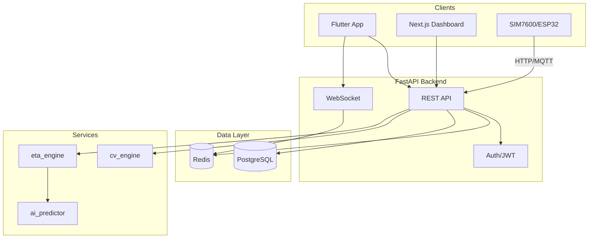

# Technical Documentation

## System Architecture

## Data Flow

### Telemetry Flow

1. SIM7600/ESP32 sends GPS + pixel_count to `POST /api/v1/telemetry`
2. Backend validates GPS (last-5 outlier filter)
3. Redis updates: bus:live, bus:coords, active_buses (pipeline)
4. Raw telemetry saved to PostgreSQL in background

### Auth Flow

- **Email**: `POST /auth/register` (passenger only) → `POST /auth/login` → JWT
- **Google**: `POST /auth/google` with id_token → verify with Google → create/link user → JWT
- **Admin**: Admin creates driver/admin via `POST /admin/users` (requires admin JWT)

### ETA Flow

- Heuristic: Haversine + dwell time + peak multiplier
- ML: RandomForest on trip_history (stop_id, hour, day_of_week, is_peak_hour, occupancy_level)
- Toggle: `use_ml_for_prod` in system_settings (admin only)

## ML Pipeline

- Training: `POST /admin/ml/train` pulls trip_history, trains RandomForest, saves .joblib
- Inference: ai_predictor loads model lazily, predicts delay in seconds
- Fallback: If model missing or error, eta_engine uses heuristic

## Database Schema

- **users**: id, username, email, password_hash, role, google_id, is_verified, created_by_id
- **vehicles**: id, plate_number, device_id, bus_type, capacity, is_active
- **routes**, **stops**, **route_stops**: Static path definitions
- **assignments**: driver_id, vehicle_id, route_id, status (active/completed)
- **raw_telemetry**: Bronze layer, retention 30 days
- **trip_history**: Stop events for ML
- **system_settings**: key-value runtime config

## Redis Keys

- `bus:live:{plate}`: Hash, TTL 10min
- `bus:coords:{plate}`: List of last 5 coords, TTL 10min
- `active_buses`: GEO index for nearby lookup
