# BusTrack Backend - Complete Diagrams

## Entity-Relationship (ER) Diagram

```mermaid
erDiagram
    User {
        int id PK
        string username UK
        string email UK
        string password_hash
        string role
        string google_id UK
        bool is_verified
        int created_by_id FK
        datetime created_at
    }

    Vehicle {
        int id PK
        string plate_number UK
        string device_id UK
        string bus_type
        int capacity
        bool is_active
        int route_id FK
        float last_lat
        float last_lon
        float speed
        datetime position_updated_at
    }

    Route {
        int id PK
        string route_number UK
        string name
        string origin
        string destination
        bool active
    }

    Stop {
        int id PK
        string name
        float lat
        float lon
        int base_dwell_time
        bool is_terminal
        float peak_multiplier
    }

    RouteStop {
        int route_id PK FK
        int stop_id PK FK
        int sequence_order
    }

    Assignment {
        int id PK
        int driver_id FK
        int vehicle_id FK
        int route_id FK
        datetime start_time
        datetime end_time
        string status
    }

    RawTelemetry {
        int id PK
        datetime timestamp
        int vehicle_id FK
        float raw_lat
        float raw_lon
        int pixel_count
        string raw_payload
    }

    TripHistory {
        int id PK
        int assignment_id FK
        int stop_id FK
        datetime arrival_time
        int dwell_time
        int occupancy_level
        int heuristic_eta
        int ml_eta
        int actual_travel_time
    }

    ModelPerformance {
        int id PK
        int trip_history_id FK
        float heuristic_error
        float ml_error
        datetime timestamp
    }

    Favorite {
        int id PK
        int user_id FK
        int route_id FK
        string nickname
    }

    Rating {
        int id PK
        int user_id FK
        int assignment_id FK
        int score
        string comment
        datetime timestamp
    }

    NotificationSetting {
        int id PK
        int user_id FK
        int route_id FK
        int lead_time_minutes
    }

    SystemSettings {
        int id PK
        string key UK
        string value
    }

    DriverBusSession {
        int id PK
        int driver_id FK
        int vehicle_id FK
        datetime login_at
        datetime logout_at
        string status
    }

    User ||--o{ Assignment : "drives"
    User ||--o{ Favorite : "saves"
    User ||--o{ Rating : "rates"
    User ||--o{ NotificationSetting : "configures"
    User ||--o{ DriverBusSession : "logs_in"
    User }o--o{ User : "created_by"

    Vehicle }o--|| Route : "assigned"
    Vehicle ||--o{ Assignment : "used_in"
    Vehicle ||--o{ RawTelemetry : "telemetry"
    Vehicle ||--o{ DriverBusSession : "sessions"

    Route ||--o{ Vehicle : "has"
    Route ||--o{ RouteStop : "stops"
    Route ||--o{ Assignment : "used_in"
    Route ||--o{ Favorite : "favorited"
    Route ||--o{ NotificationSetting : "alerts"

    Stop ||--o{ RouteStop : "part_of"
    Stop ||--o{ TripHistory : "arrivals"

    RouteStop }o--|| Route : "belongs_to"
    RouteStop }o--|| Stop : "is_stop"

    Assignment }o--|| User : "driver"
    Assignment }o--|| Vehicle : "vehicle"
    Assignment }o--|| Route : "route"
    Assignment ||--o{ TripHistory : "trips"
    Assignment ||--o{ Rating : "ratings"

    TripHistory }o--|| Assignment : "from"
    TripHistory }o--|| Stop : "at"
    TripHistory ||--o{ ModelPerformance : "evaluated"

    ModelPerformance }o--|| TripHistory : "references"

    Favorite }o--|| User : "owner"
    Favorite }o--|| Route : "saved"

    Rating }o--|| User : "rater"
    Rating }o--|| Assignment : "about"

    NotificationSetting }o--|| User : "owner"
    NotificationSetting }o--|| Route : "for"

    DriverBusSession }o--|| User : "driver"
    DriverBusSession }o--|| Vehicle : "bus"
```

---

## System Architecture Diagram

```mermaid
flowchart TB
    subgraph Clients["Clients"]
        ESP32["ESP32-CAM + SIM7600"]
        PassengerApp["Passenger App"]
        DriverApp["Driver / Bus Dashboard"]
        AdminFE["Admin Dashboard"]
    end

    subgraph Backend["FastAPI Backend"]
        subgraph API["API v1 Endpoints"]
            AuthAPI["/auth/*<br/>register, login, google<br/>driver-login, bus-dashboard"]
            VehicleAPI["/vehicles/*<br/>CRUD, telemetry, positions"]
            GatewayAPI["/gateway/*<br/>esp32 telemetry multipart"]
            TrackAPI["/tracking/*<br/>telemetry ingestion"]
            RouteAPI["/routes/*<br/>routes and stops"]
            AssignAPI["/assignments/*<br/>start, end, active"]
            SearchAPI["/search/*<br/>point-to-point"]
            FavAPI["/favorites/*<br/>save, list"]
            RatingAPI["/ratings/*<br/>rate trips"]
            NotifAPI["/notifications/*<br/>settings, alerts"]
            WS["/ws/live<br/>WebSocket stream"]
            AdminAPI["/admin/*<br/>dashboard, ml, settings"]
            AdminUsersAPI["/admin/users/*<br/>create, update, delete"]
        end

        subgraph Services["Services"]
            CV["cv_engine<br/>OpenCV people detection"]
            ETACalc["eta_calc<br/>Heuristic ETA"]
            ETAEngine["eta_engine<br/>Heuristic vs ML toggle"]
            RouteETA["route_eta<br/>Stop ETA payloads"]
            AIPredictor["ai_predictor<br/>ML delay prediction"]
            RouteVal["route_validation<br/>On-route check"]
            LiveB["live_broadcast<br/>WebSocket broadcast"]
            RedisCache["redis_cache<br/>Coord history, live pipeline"]
            RedisClient["redis_client<br/>Bus keys, geo index"]
            Trainer["trainer<br/>ML model training"]
            WSMgr["websocket manager<br/>Connection manager"]
        end

        subgraph Core["Core"]
            Security["security<br/>JWT, OAuth, RBAC"]
            Limiter["limiter<br/>Rate limiting"]
            Config["config<br/>Settings env"]
            Middleware["middleware<br/>Security headers"]
        end

        subgraph Utils["Utils"]
            GPSVal["gps_validation<br/>Haversine, outlier check"]
        end

        subgraph CRUD["CRUD Layer"]
            CRUD_User["user"]
            CRUD_Vehicle["vehicle"]
            CRUD_Route["route"]
            CRUD_Assignment["assignment"]
            CRUD_Tracking["tracking"]
            CRUD_Settings["system_settings"]
            CRUD_Session["driver_bus_session"]
        end

        subgraph Tasks["Tasks"]
            Cleanup["cleanup<br/>Data retention"]
        end

        subgraph DB["Database"]
            Base["base<br/>DeclarativeBase"]
            Session["session<br/>AsyncSession asyncpg"]
        end
    end

    subgraph External["External"]
        PG[("PostgreSQL<br/>14 tables")]
        RedisS[("Redis<br/>Cache + Geo")]
        GoogleOAuth["Google OAuth"]
    end

    ESP32 -->|"multipart"| GatewayAPI
    ESP32 -->|"JSON"| TrackAPI
    ESP32 -->|"JSON"| VehicleAPI

    DriverApp -->|"driver-login"| AuthAPI
    DriverApp -->|"bus-dashboard"| AuthAPI

    PassengerApp -->|"register, login"| AuthAPI
    PassengerApp -->|"search, favorites"| SearchAPI
    PassengerApp -->|"ratings"| RatingAPI
    PassengerApp -->|"notifications"| NotifAPI

    AdminFE -->|"JWT"| AuthAPI
    AdminFE -->|"WS"| WS
    AdminFE -->|"dashboard, ml"| AdminAPI
    AdminFE -->|"users"| AdminUsersAPI

    GatewayAPI --> CV
    GatewayAPI --> RedisCache
    GatewayAPI --> LiveB
    GatewayAPI --> CRUD_Vehicle
    GatewayAPI --> CRUD_Tracking

    TrackAPI --> RouteVal
    TrackAPI --> GPSVal
    TrackAPI --> ETACalc
    TrackAPI --> RouteETA
    TrackAPI --> RedisCache
    TrackAPI --> RedisClient
    TrackAPI --> LiveB
    TrackAPI --> CRUD_Vehicle
    TrackAPI --> CRUD_Assignment
    TrackAPI --> CRUD_Tracking

    VehicleAPI --> CV
    VehicleAPI --> LiveB
    VehicleAPI --> CRUD_Vehicle

    ETAEngine --> ETACalc
    ETAEngine --> AIPredictor

    LiveB --> WSMgr
    WSMgr -->|"vehicle_position"| WS
    WS -->|"stream"| AdminFE

    AuthAPI --> Security
    AuthAPI --> GoogleOAuth
    AuthAPI --> CRUD_User
    AuthAPI --> CRUD_Vehicle
    AuthAPI --> CRUD_Session

    AdminAPI --> Trainer
    AdminAPI --> AIPredictor
    AdminAPI --> ETAEngine
    AdminAPI --> Cleanup
    AdminAPI --> CRUD_Settings

    CRUD_User --> PG
    CRUD_Vehicle --> PG
    CRUD_Route --> PG
    CRUD_Assignment --> PG
    CRUD_Tracking --> PG
    CRUD_Settings --> PG
    CRUD_Session --> PG

    RedisCache --> RedisS
    RedisClient --> RedisS
    LiveB --> RedisS
```



---

## Redis Key Schema

| Key Pattern | Type | TTL | Description |
|---|---|---|---|
| `bus:live:{plate}` | Hash | 600s | Live bus state: lat, lon, speed, occupancy, assignment_id |
| `bus:coords:{plate}` | List | 600s | Last 5 GPS coords for outlier detection |
| `route:{no}:stop:{id}` | Hash | 300s | Pre-calculated ETA payload for stop on route |
| `veh:pos:{plate}` | String | 300s | Last known position [lat, lon] |
| `veh:hist:{plate}` | List | 300s | Coordinate history for GPS validation |
| `pipe:positions` | Stream | - | Redis Stream of live position updates |
| `active_buses` | Geo Set | - | Geospatial index of active buses |

---

## Data Flow Summary

1. **ESP32 Telemetry** → Gateway/Tracking API → GPS Validation → Route Validation → ETA Calculation → Redis Cache → WebSocket Broadcast → Admin Dashboard
2. **Raw Telemetry** → PostgreSQL raw_telemetry → TripHistory → ML Training → ModelPerformance
3. **User Actions** → Auth (JWT) → CRUD → PostgreSQL
4. **Admin Analytics** → PostgreSQL aggregations → JSON response
5. **ML Pipeline** → trip_history → trainer.py → delay_predictor.joblib → ai_predictor.py → ETA decisions
