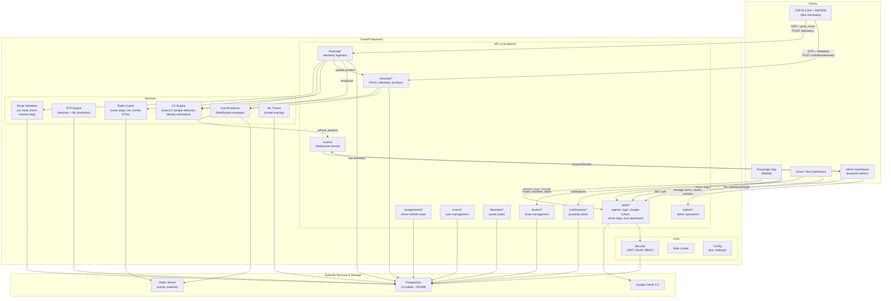

# BusTrack Backend Diagrams

## Entity-Relationship (ER) Diagram

```mermaid
erDiagram
    User {
        int id PK
        string username UK
        string email UK
        string password_hash nullable
        string role "passenger|driver|admin"
        string google_id UK nullable
        bool is_verified
        int created_by_id FK nullable
        datetime created_at
    }

    Vehicle {
        int id PK
        string plate_number UK
        string device_id UK "IMEI/SIM7600 ID"
        string bus_type nullable
        int capacity nullable
        bool is_active
        int route_id FK nullable
        float last_lat nullable
        float last_lon nullable
        float speed nullable
        datetime position_updated_at nullable
    }

    Route {
        int id PK
        string route_number UK
        string name
        string origin nullable
        string destination nullable
        bool active
    }

    Stop {
        int id PK
        string name
        float lat
        float lon
        int base_dwell_time "default 30s"
        bool is_terminal
        float peak_multiplier "default 1.5"
    }

    RouteStop {
        int route_id PK FK
        int stop_id PK FK
        int sequence_order
    }

    Assignment {
        int id PK
        int driver_id FK
        int vehicle_id FK
        int route_id FK
        datetime start_time
        datetime end_time nullable
        string status "active|completed"
    }

    RawTelemetry {
        int id PK
        datetime timestamp
        int vehicle_id FK
        float raw_lat
        float raw_lon
        int pixel_count nullable
        jsonb raw_payload nullable
    }

    TripHistory {
        int id PK
        int assignment_id FK
        int stop_id FK
        datetime arrival_time
        int dwell_time nullable
        int occupancy_level nullable
        int heuristic_eta nullable
        int ml_eta nullable
        int actual_travel_time nullable
    }

    ModelPerformance {
        int id PK
        int trip_history_id FK
        float heuristic_error nullable
        float ml_error nullable
        datetime timestamp
    }

    Favorite {
        int id PK
        int user_id FK
        int route_id FK
        string nickname nullable
    }

    Rating {
        int id PK
        int user_id FK
        int assignment_id FK
        int score "1-5"
        text comment nullable
        datetime timestamp
    }

    NotificationSetting {
        int id PK
        int user_id FK
        int route_id FK
        int lead_time_minutes "default 10"
    }

    SystemSettings {
        int id PK
        string key UK
        string value nullable
    }

    DriverBusSession {
        int id PK
        int driver_id FK
        int vehicle_id FK
        datetime login_at
        datetime logout_at nullable
        string status "active|ended"
    }

    %% Relationships
    User ||--o{ Assignment : "drives"
    User ||--o{ Favorite : "saves"
    User ||--o{ Rating : "submits"
    User ||--o{ NotificationSetting : "configures"
    User ||--o{ DriverBusSession : "logs into"
    User |o--o{ User : "created_by (self)"

    Vehicle }o--|| Route : "assigned to"
    Vehicle ||--o{ Assignment : "used in"
    Vehicle ||--o{ RawTelemetry : "generates"
    Vehicle ||--o{ DriverBusSession : "has"

    Route ||--o{ Vehicle : "has"
    Route ||--o{ RouteStop : "includes"
    Route ||--o{ Assignment : "used in"
    Route ||--o{ Favorite : "favorited"
    Route ||--o{ NotificationSetting : "alerts"

    Stop ||--o{ RouteStop : "part of"
    Stop ||--o{ TripHistory : "arrivals"

    RouteStop }o--|| Route : "belongs to"
    RouteStop }o--|| Stop : "is"

    Assignment }o--|| User : "driver"
    Assignment }o--|| Vehicle : "vehicle"
    Assignment }o--|| Route : "follows"
    Assignment ||--o{ TripHistory : "generates"
    Assignment ||--o{ Rating : "rated"

    TripHistory }o--|| Assignment : "from"
    TripHistory }o--|| Stop : "at"
    TripHistory ||--o{ ModelPerformance : "evaluated"

    ModelPerformance }o--|| TripHistory : "references"
```

## System Architecture Diagram



## Notes

- **Database**: PostgreSQL with async SQLAlchemy (JSONB type confirms PostgreSQL)
- **Auth**: JWT-based with Google OAuth fallback, role-based access (passenger/driver/admin)
- **Real-time**: WebSocket (`/ws/live`) streams vehicle positions to admin dashboard
- **Telemetry**: Dual ingestion paths (`/telemetry` and `/vehicles/telemetry`) with GPS validation, outlier rejection, and on-route checks
- **ML Components**: Heuristic and ML-based ETA prediction with performance tracking for research
- **Hardware**: ESP32-CAM captures frames + SIM7600 (Neo6M GPS) sends telemetry via HTTP
