# BusTrack Backend - Complete Diagrams

## Entity-Relationship (ER) Diagram

```mermaid
erDiagram
    %% ===================== USERS =====================
    User {
        int id PK
        string username UK "max 100 chars"
        string email UK "max 255 chars"
        string password_hash nullable "bcrypt hash"
        string role "passenger|driver|admin"
        string google_id UK nullable
        bool is_verified "default false"
        int created_by_id FK nullable "self-ref to User"
        datetime created_at "timezone-aware"
    }

    %% ===================== VEHICLES =====================
    Vehicle {
        int id PK
        string plate_number UK "max 20 chars"
        string device_id UK "IMEI/SIM7600 ID, max 50"
        string bus_type nullable "e.g. ESP32-CAM, Anbessa"
        int capacity nullable
        bool is_active "default true"
        int route_id FK nullable
        float last_lat nullable
        float last_lon nullable
        float speed nullable "km/h"
        datetime position_updated_at nullable "timezone-aware"
    }

    %% ===================== ROUTES =====================
    Route {
        int id PK
        string route_number UK "max 20 chars"
        string name "max 200 chars"
        string origin nullable
        string destination nullable
        bool active "default true"
    }

    %% ===================== STOPS =====================
    Stop {
        int id PK
        string name "indexed, max 100"
        float lat
        float lon
        int base_dwell_time "default 30 seconds"
        bool is_terminal "default false"
        float peak_multiplier "default 1.5"
    }

    %% ===================== ROUTE STOPS (Junction) =====================
    RouteStop {
        int route_id PK FK "CASCADE delete"
        int stop_id PK FK
        int sequence_order "order in route"
    }

    %% ===================== ASSIGNMENTS =====================
    Assignment {
        int id PK
        int driver_id FK "→ User"
        int vehicle_id FK "→ Vehicle"
        int route_id FK "→ Route"
        datetime start_time "default now, timezone"
        datetime end_time nullable
        string status "active|completed, default active"
    }

    %% ===================== RAW TELEMETRY =====================
    RawTelemetry {
        int id PK
        datetime timestamp "default now, timezone"
        int vehicle_id FK "→ Vehicle"
        float raw_lat
        float raw_lon
        int pixel_count nullable "from ESP32-CAM"
        jsonb raw_payload nullable "PostgreSQL JSONB"
    }

    %% ===================== TRIP HISTORY =====================
    TripHistory {
        int id PK
        int assignment_id FK "→ Assignment"
        int stop_id FK "→ Stop"
        datetime arrival_time "default now, timezone"
        int dwell_time nullable "seconds"
        int occupancy_level nullable "0=Low,1=Med,2=High"
        int heuristic_eta nullable "seconds"
        int ml_eta nullable "seconds"
        int actual_travel_time nullable "seconds"
    }

    %% ===================== MODEL PERFORMANCE =====================
    ModelPerformance {
        int id PK
        int trip_history_id FK "→ TripHistory"
        float heuristic_error nullable "MAE"
        float ml_error nullable "MAE"
        datetime timestamp "default now, timezone"
    }

    %% ===================== FAVORITES =====================
    Favorite {
        int id PK
        int user_id FK "→ User"
        int route_id FK "→ Route"
        string nickname nullable "max 50 chars, e.g. 'Work'"
    }

    %% ===================== RATINGS =====================
    Rating {
        int id PK
        int user_id FK "→ User"
        int assignment_id FK "→ Assignment"
        int score "1-5"
        text comment nullable
        datetime timestamp "default now, timezone"
    }

    %% ===================== NOTIFICATION SETTINGS =====================
    NotificationSetting {
        int id PK
        int user_id FK "→ User"
        int route_id FK "→ Route"
        int lead_time_minutes "default 10"
    }

    %% ===================== SYSTEM SETTINGS =====================
    SystemSettings {
        int id PK
        string key UK "max 100 chars"
        string value nullable "max 500 chars"
    }

    %% ===================== DRIVER BUS SESSIONS =====================
    DriverBusSession {
        int id PK
        int driver_id FK "→ User, indexed"
        int vehicle_id FK "→ Vehicle, indexed"
        datetime login_at "default now, timezone"
        datetime logout_at nullable
        string status "active|ended, default active"
    }

    %% ===================== RELATIONSHIPS =====================

    %% User relationships
    User ||--o{ Assignment : "drives (driver)"
    User ||--o{ Favorite : "saves routes"
    User ||--o{ Rating : "submits ratings"
    User ||--o{ NotificationSetting : "configures alerts"
    User ||--o{ DriverBusSession : "logs into bus"
    User |o--o| User : "created_by (admin)"

    %% Vehicle relationships
    Vehicle }o--|| Route : "assigned to route"
    Vehicle ||--o{ Assignment : "used in assignments"
    Vehicle ||--o{ RawTelemetry : "generates telemetry"
    Vehicle ||--o{ DriverBusSession : "has sessions"

    %% Route relationships
    Route ||--o{ Vehicle : "has vehicles"
    Route ||--o{ RouteStop : "has ordered stops"
    Route ||--o{ Assignment : "used in assignments"
    Route ||--o{ Favorite : "favorited by users"
    Route ||--o{ NotificationSetting : "has alert settings"

    %% Stop relationships
    Stop ||--o{ RouteStop : "part of routes"
    Stop ||--o{ TripHistory : "arrival events"

    %% RouteStop (junction)
    RouteStop }o--|| Route : "belongs to route"
    RouteStop }o--|| Stop : "is a stop"

    %% Assignment relationships
    Assignment }o--|| User : "driver"
    Assignment }o--|| Vehicle : "vehicle"
    Assignment }o--|| Route : "route"
    Assignment ||--o{ TripHistory : "generates trips"
    Assignment ||--o{ Rating : "rated by passengers"

    %% TripHistory relationships
    TripHistory }o--|| Assignment : "from assignment"
    TripHistory }o--|| Stop : "at stop"
    TripHistory ||--o{ ModelPerformance : "evaluated"

    %% ModelPerformance relationships
    ModelPerformance }o--|| TripHistory : "references"

    %% Favorite relationships
    Favorite }o--|| User : "owner"
    Favorite }o--|| Route : "saved route"

    %% Rating relationships
    Rating }o--|| User : "rater"
    Rating }o--|| Assignment : "about"

    %% NotificationSetting relationships
    NotificationSetting }o--|| User : "owner"
    NotificationSetting }o--|| Route : "for route"

    %% DriverBusSession relationships
    DriverBusSession }o--|| User : "driver"
    DriverBusSession }o--|| Vehicle : "bus"
```

---

## System Architecture Diagram

```mermaid
flowchart TB
    %% ===================== CLIENTS =====================
    subgraph Clients["Clients"]
        ESP32["ESP32-CAM + SIM7600<br/>(Bus Hardware)<br/>- Captures frames<br/>- GPS telemetry<br/>- Multipart POST"]
        PassengerApp["Passenger App<br/>(Mobile/Web)<br/>- Search routes<br/>- View ETAs<br/>- Rate trips<br/>- Save favorites"]
        DriverApp["Driver / Bus Dashboard<br/>(Tablet/Phone)<br/>- Driver login<br/>- Bus dashboard login<br/>- View assignments"]
        AdminFE["Admin Dashboard<br/>(bustrack-admin)<br/>- Fleet view<br/>- Analytics<br/>- ML training<br/>- User management"]
    end

    %% ===================== FASTAPI BACKEND =====================
    subgraph Backend["FastAPI Backend (v1.0.0)"]
        subgraph API["API v1 Endpoints (11 routers)"]

            %% Auth endpoints
            AuthAPI["/api/v1/auth/*<br/>├─ POST /register<br/>├─ POST /login<br/>├─ POST /google<br/>├─ GET /me<br/>├─ POST /refresh<br/>├─ POST /driver-login<br/>├─ POST /driver-logout<br/>└─ POST /bus-dashboard/login"]

            %% Vehicles endpoints
            VehicleAPI["/api/v1/vehicles/*<br/>├─ POST / (create)<br/>├─ GET / (list)<br/>├─ GET /{id}<br/>├─ PUT /{id}<br/>├─ POST /telemetry<br/>├─ GET /positions<br/>└─ GET /positions/{id}"]

            %% Gateway endpoints
            GatewayAPI["/api/v1/gateway/*<br/>└─ POST /esp32/telemetry<br/>(multipart: image + GPS + metadata)"]

            %% Tracking endpoints
            TrackAPI["/api/v1/tracking/*<br/>└─ POST /telemetry<br/>(GPS validation, outlier rejection)"]

            %% Routes endpoints
            RouteAPI["/api/v1/routes/*<br/>├─ POST /stops<br/>├─ GET /stops<br/>├─ GET /stops/{id}<br/>├─ POST /routes<br/>├─ GET /routes<br/>└─ GET /routes/{id}"]

            %% Assignments endpoints
            AssignAPI["/api/v1/assignments/*<br/>├─ GET /active<br/>├─ POST /start<br/>└─ POST /end"]

            %% Search endpoints
            SearchAPI["/api/v1/search/*<br/>└─ POST /point-to-point<br/>(find routes between stops)"]

            %% Favorites & Ratings
            FavAPI["/api/v1/favorites/*<br/>├─ POST / (add)<br/>└─ GET /{user_id}"]
            RatingAPI["/api/v1/ratings/*<br/>├─ POST / (add)<br/>└─ GET /{assignment_id}"]

            %% Notifications
            NotifAPI["/api/v1/notifications/*<br/>├─ POST /settings<br/>└─ GET /settings/{user_id}"]

            %% WebSocket
            WS["/api/v1/ws/live<br/>(WebSocket)<br/>- Admin-only<br/>- Streams vehicle_position<br/>- Ping/pong + heartbeat"]

            %% Admin endpoints
            AdminAPI["/api/v1/admin/*<br/>├─ GET /use-ml<br/>├─ GET /dashboard/summary<br/>├─ GET /dashboard/assignments-over-time<br/>├─ GET /dashboard/occupancy-distribution<br/>├─ GET /dashboard/eta-accuracy<br/>├─ GET /dashboard/route-usage<br/>├─ GET /dashboard/telemetry-volume<br/>├─ GET /ml/status<br/>├─ POST /cleanup<br/>├─ POST /ml/train<br/>├─ POST /eta/preview<br/>├─ GET /settings<br/>└─ PUT /settings"]

            %% Admin Users
            AdminUsersAPI["/api/v1/admin/users/*<br/>├─ POST /create<br/>├─ GET /list<br/>├─ DELETE /delete/{id}<br/>├─ PUT /update/{id}<br/>├─ GET /me<br/>├─ GET /search<br/>├─ GET /drivers<br/>└─ GET /admins"]
        end

        subgraph Services["Services Layer"]
            CV["cv_engine.py<br/>OpenCV HOG People Detection<br/>- count_people_from_image()<br/>- estimate_density()<br/>- estimate_density_from_image()"]

            ETA_Calc["eta_calc.py<br/>Heuristic ETA Calculation<br/>(Haversine + dwell time)"]

            ETA_Engine["eta_engine.py<br/>Master ETA Service<br/>- get_final_eta()<br/>- Heuristic vs ML toggle"]

            RouteETA["route_eta.py<br/>Route Stop ETA Payloads<br/>- estimate_route_stop_eta_payloads()<br/>- Speed + occupancy multiplier"]

            AI_Predictor["ai_predictor.py<br/>ML Delay Prediction<br/>- predict_delay()<br/>- model: delay_predictor.joblib<br/>- Features: stop_id, hour, dow, peak, occupancy"]

            RouteVal["route_validation.py<br/>On-Route Validation<br/>- is_on_route() (200m threshold)<br/>- find_nearest_stop()"]

            LiveB["live_broadcast.py<br/>WebSocket Broadcast<br/>- broadcast_vehicle_position()<br/>→ manager.broadcast()"]

            RedisCache["redis_cache.py<br/>Redis Cache Helpers<br/>- get_last_coords()<br/>- set_bus_live_pipeline()<br/>- push_live_position()"]

            RedisClient["redis_client.py<br/>Redis Connection + Keys<br/>- bus:live:{plate}<br/>- bus:coords:{plate}<br/>- route:{no}:stop:{id}<br/>- active_buses (geo)"]

            Trainer["trainer.py<br/>ML Model Training<br/>- train_from_db()<br/>→ saves delay_predictor.joblib"]

            WSMgr["websocket.py<br/>ConnectionManager<br/>- active_connections list<br/>- connect/register/disconnect<br/>- broadcast()"]
        end

        subgraph Core["Core Layer"]
            Security["security.py<br/>- JWT create/verify<br/>- get_current_user<br/>- RequireAdmin dependency<br/>- Role-based access"]
            Limiter["limiter.py<br/>SlowAPI Rate Limiting<br/>- Per-IP limits<br/>- 60/min default"]
            Config["config.py (Settings)<br/>- DATABASE_URL<br/>- REDIS_URL<br/>- SECRET_KEY<br/>- USE_ML_FOR_PROD<br/>- GOOGLE_CLIENT_ID<br/>- BUS_LIVE_TTL=600<br/>- ROUTE_STOP_TTL=300"]
            Middleware["middleware/<br/>- SecurityHeadersMiddleware<br/>(X-Content-Type-Options,<br/>X-Frame-Options, X-XSS-Protection)"]
        end

        subgraph Utils["Utils"]
            GPSVal["gps_validation.py<br/>- haversine_meters()<br/>- is_valid_coord()<br/>- get_average_coord()<br/>(rejects GPS jumps >500m)"]
        end

        subgraph CRUD["CRUD Layer"]
            CRUD_User["user.py"]
            CRUD_Vehicle["vehicle.py"]
            CRUD_Route["route.py"]
            CRUD_Assignment["assignment.py"]
            CRUD_Tracking["tracking.py"]
            CRUD_Settings["system_settings.py"]
            CRUD_Session["driver_bus_session.py"]
        end

        subgraph Tasks["Background Tasks"]
            Cleanup["cleanup.py<br/>- cleanup_raw_telemetry()<br/>- cleanup_trip_history()<br/>- Data retention (30d/365d)"]
        end

        subgraph DB["Database Layer"]
            Base["base.py<br/>DeclarativeBase"]
            Session["session.py<br/>- AsyncSession (asyncpg)<br/>- get_db() dependency<br/>- pool_pre_ping=True"]
        end
    end

    %% ===================== EXTERNAL SERVICES =====================
    subgraph External["External Services & Storage"]
        PG[("PostgreSQL 14+<br/>14 Tables<br/>(JSONB supported)")]
        RedisS[("Redis Server<br/>Cache + Pub/Sub<br/>- bus:live:* (TTL 600s)<br/>- bus:coords:* (TTL 600s)<br/>- route:*:stop:* (TTL 300s)<br/>- veh:pos:{plate}<br/>- veh:hist:{plate}<br/>- pipe:positions (Stream)<br/>- active_buses (Geo)<br/>- route:{no}:stop:{id}")]
        GoogleOAuth["Google OAuth 2.0<br/>- ID token verification<br/>- email + google_id"]
    end

    %% ===================== DATA FLOWS =====================

    %% ESP32 flows
    ESP32 -->|"Multipart POST<br/>/api/v1/gateway/esp32/telemetry<br/>(image + GPS + metadata)"| GatewayAPI
    ESP32 -->|"JSON POST<br/>/api/v1/tracking/telemetry<br/>(GPS + pixel_count)"| TrackAPI
    ESP32 -->|"JSON POST<br/>/api/v1/vehicles/telemetry<br/>(legacy)"| VehicleAPI

    %% Driver flows
    DriverApp -->|"POST /driver-login<br/>(username + password + device_id + bus_token)"| AuthAPI
    DriverApp -->|"POST /bus-dashboard/login<br/>(vehicle_id + device_id + password)"| AuthAPI

    %% Passenger flows
    PassengerApp -->|"POST /register, /login, /google"| AuthAPI
    PassengerApp -->|"GET /routes, /search/point-to-point"| SearchAPI
    PassengerApp -->|"POST /favorites, /ratings"| FavAPI
    PassengerApp -->|"POST /notifications/settings"| NotifAPI

    %% Admin flows
    AdminFE -->|"JWT Bearer token"| AuthAPI
    AdminFE -->|"WebSocket /ws/live"| WS
    AdminFE -->|"GET /admin/dashboard/*"| AdminAPI
    AdminFE -->|"POST /admin/users/*"| AdminUsersAPI

    %% Internal flows - Gateway
    GatewayAPI --> CV
    GatewayAPI --> RedisCache
    GatewayAPI --> LiveB
    GatewayAPI --> CRUD_Vehicle
    GatewayAPI --> CRUD_Tracking

    %% Internal flows - Tracking
    TrackAPI --> RouteVal
    TrackAPI --> GPSVal
    TrackAPI --> ETA_Calc
    TrackAPI --> RouteETA
    TrackAPI --> RedisCache
    TrackAPI --> RedisClient
    TrackAPI --> LiveB
    TrackAPI --> CRUD_Vehicle
    TrackAPI --> CRUD_Assignment
    TrackAPI --> CRUD_Tracking

    %% Internal flows - Vehicles
    VehicleAPI --> CV
    VehicleAPI --> LiveB
    VehicleAPI --> CRUD_Vehicle

    %% Internal flows - ETA
    ETA_Engine --> ETA_Calc
    ETA_Engine --> AI_Predictor

    %% Internal flows - Live Broadcast
    LiveB --> WSMgr
    WSMgr -->|"vehicle_position JSON"| WS
    WS -->|"stream"| AdminFE

    %% Internal flows - Auth
    AuthAPI --> Security
    AuthAPI --> GoogleOAuth
    AuthAPI --> CRUD_User
    AuthAPI --> CRUD_Vehicle
    AuthAPI --> CRUD_Session

    %% Internal flows - Admin
    AdminAPI --> Trainer
    AdminAPI --> AI_Predictor
    AdminAPI --> ETA_Engine
    AdminAPI --> Cleanup
    AdminAPI --> CRUD_Settings

    %% DB connections
    CRUD_User --> PG
    CRUD_Vehicle --> PG
    CRUD_Route --> PG
    CRUD_Assignment --> PG
    CRUD_Tracking --> PG
    CRUD_Settings --> PG
    CRUD_Session --> PG

    %% Redis connections
    RedisCache --> RedisS
    RedisClient --> RedisS
    LiveB --> RedisS

    %% Config
    Config --> PG
    Config --> RedisS
```



---

## Redis Key Schema

| Key Pattern | Type | TTL | Description |
|---|---|---|---|
| `bus:live:{plate_number}` | Hash | 600s | Live bus state: lat, lon, speed, occupancy_level, assignment_id |
| `bus:coords:{plate_number}` | List | 600s | Circular buffer (last 5 GPS coords) for outlier detection |
| `route:{route_no}:stop:{stop_id}` | Hash | 300s | Pre-calculated ETA payload for a stop on a route |
| `veh:pos:{plate}` | String (JSON) | 300s | Last known position [lat, lon] |
| `veh:hist:{plate}` | List | 300s | Coordinate history for GPS validation |
| `pipe:positions` | Stream | - | Redis Stream of live position updates |
| `active_buses` | Geo Set | - | Geospatial index of all active buses (lon, lat, plate) |

---

## Data Flow Summary

1. **ESP32 Telemetry** → Gateway/Tracking API → GPS Validation → Route Validation → ETA Calculation → Redis Cache → WebSocket Broadcast → Admin Dashboard
2. **Raw Telemetry** → PostgreSQL (raw_telemetry table) → ML Training (trip_history → ModelPerformance)
3. **User Actions** → Auth (JWT) → CRUD → PostgreSQL
4. **Admin Analytics** → Read from PostgreSQL (aggregations) → JSON response
5. **ML Pipeline** → trip_history → trainer.py → delay_predictor.joblib → ai_predictor.py → ETA decisions
